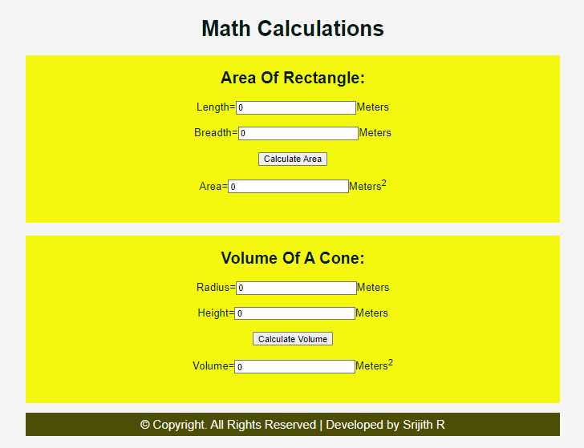

# AngularCalculation

# Web Page for Mathematical Calculations using Angular

## AIM:
To design a dynamic website to perform mathematical calculations using Angular Framwork

## DESIGN STEPS:

### Step 1:

Requirement collection.

### Step 2:

Creating the layout using HTML and CSS in component.html file.

### Step 3:

Write typescript to perform the calculations.

### Step 4:

Validate the layout in various browsers.

### Step 5:

Validate the HTML code.

### Step 6:

Publish the website in the given URL.

## PROGRAM :
### app.component.html:
```
<div class="container">
    <h1>Math Calculations</h1>
    <Rectangle-Area class="content"> </Rectangle-Area>
    <VolumeCone-Area class="content"> </VolumeCone-Area>
    <div class="footer">
        &copy; Copyright. All Rights Reserved | Developed by Srijith R
      </div>
</div>
```
### styles.css:
```
/* You can add global styles to this file, and also import other style files */

* {
    box-sizing: border-box;
    font-family: Arial, Helvetica, sans-serif;
}

body {
    background-color: whitesmoke;
    color: #081c15;
}

.container {
    text-align: center;
    width: 1080px;
    height: 850px;
    margin-left: auto;
    margin-right: auto;
    margin-top: auto;
}

.content {
    display: block;
    width: 100%;
    margin-left: auto;
    margin-right: auto;
    background-color: #f4f80f;
    height: 250px;
    width: 800px;
    text-align: center;
}

.content1 {
    display: block;
    width: 100%;
    background-color: #f4f80f;
    margin-top: 15px;
    height: 100px;
    width: 800px;
}

h1 {
    color: #081c15;
    text-align: center;
    padding-top: 20px;
}

h2 {
    color: #081c15;
    text-align: center;
    padding-top: 20px;
}

.forms {
    text-align: center;
    padding-top: 20px;
    font-size: larger;
}

.footer {
    color: whitesmoke;
    margin-top: 15px;
    display: inline-block;
    height: 35px;
    width: 800px;
    background-color: #4d4e06;
    text-align: center;
    padding-top: 7px;
    font-size: large;
}
```
### rect.component.html:
```
<div>
    <h2>Area Of Rectangle:</h2>
    Length=<input type="text" [(ngModel)]="length">Meters<br/>
    <br/>
    Breadth=<input type="text"[(ngModel)]='breadth'>Meters<br/>
    <br/>
    <input type="button" (click)="onCalculate()" value="Calculate Area"><br/>
    <br/>
    Area=<input type="text" [value]="area">Meters<sup>2</sup>
</div>
```
### rect.component.ts:
```
import { Component } from "@angular/core";

@Component({
    selector:'Rectangle-Area',
    templateUrl:'./rect.component.html'
})
export class RectangleComponent{
    length:number;
    breadth:number;
    area:number;
    
    constructor(){
        this.length=0
        this.breadth=0
        this.area=this.length*this.breadth

    }
    onCalculate(){
        this.area=this.length*this.breadth
    }
}
```
### volumecone.component.html:
```
<div>  
        <div style="text-align: center;">
            <h2>Volume Of A Cone:</h2>
            Radius=<input type="text" [(ngModel)]="radius">Meters<br/>
            <br/>
            Height=<input type="text"[(ngModel)]='height'>Meters<br/>
            <br/>
            <input type="button" (click)="onCalc()" value="Calculate Volume"><br/>
            <br/>
            Volume=<input type="text" [value]="volume">Meters<sup>2</sup>
        </div>
</div>
```
### volume.component.ts:
```
import { Component } from "@angular/core";

@Component({
    selector:'VolumeCone-Area',
    templateUrl:'./volumecone.component.html'
})
export class VolumeConeComponent{
    radius:number;
    height:number;
    volume:number;
    constructor(){
        this.radius=0
        this.height=0
        this.volume=0.34*3.14*this.radius*this.radius*this.height

    }
    onCalc(){
        this.volume=0.34*3.14*this.radius*this.radius*this.height
    }
}
```


## OUTPUT:


## Result:
A dynamic website to perform mathematical calculations is designed using Angular Framwork.
